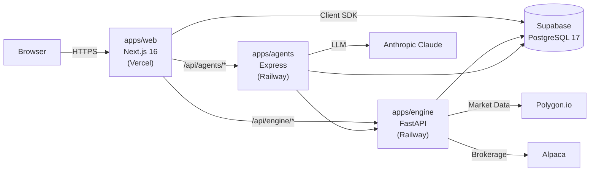

# Sentinel Trading Platform

[](https://github.com/stevenschling13/sentinel-trading-platform/actions/workflows/ci.yml)
[](https://sentinel-trading-platform-agents.vercel.app)
[](LICENSE)
[](https://nodejs.org)
[](https://python.org)
[](https://supabase.com)
[](https://turbo.build)

Evidence-based systematic trading control plane. Turborepo monorepo with a Next.js 16 dashboard, Python FastAPI quant engine, AI agent orchestrator, and Supabase-backed state.

## Features

- **Dashboard** — Real-time portfolio overview, positions, P&L tracking, and market regime indicators
- **Quant Engine** — Python FastAPI service for backtesting, signal generation, and risk analysis via Polygon & Alpaca
- **AI Agent Orchestrator** — Anthropic-powered agents for market analysis, strategy recommendations, and trade monitoring
- **Journal & Replay** — Trade journaling with full decision-replay and counterfactual analysis
- **Advisor System** — Personalized recommendations with explainability and memory
- **Onboarding** — Guided setup flow: broker connection, risk profiling, paper trading, and consent management
- **Observability** — Health endpoints, service status monitoring, and offline/simulated-data badges

## Architecture



- **apps/web** runs on **Vercel** and is the only public origin.
- **apps/engine** and **apps/agents** run on **Railway** — the browser never calls them directly.
- All backend traffic flows through same-origin Next.js route handlers (`/api/engine/*`, `/api/agents/*`).

## Repository Map

```text
apps/web/            Next.js 16 dashboard (TypeScript, port 3000)
apps/engine/         Python FastAPI quant engine (port 8000)
apps/agents/         TypeScript agent orchestrator (port 3001)
packages/shared/     Shared TypeScript contracts (@sentinel/shared)
supabase/            PostgreSQL migrations and seed data
docs/                Deployment guides, runbooks, and AI collaboration docs
scripts/             Build helpers and cross-platform utilities
```

## Tech Stack

| Layer              | Technology                                                            |
| ------------------ | --------------------------------------------------------------------- |
| **Frontend**       | Next.js 16, React 19, Tailwind CSS, shadcn/ui, Zustand                |
| **Backend**        | FastAPI (Python 3.12), Express (Node 22)                              |
| **Database**       | Supabase (PostgreSQL 17) with RLS                                     |
| **AI/ML**          | Anthropic Claude, structured agent pipelines                          |
| **Market Data**    | Polygon.io, Alpaca brokerage API                                      |
| **Infrastructure** | Vercel, Railway, Docker, Turborepo                                    |
| **Quality**        | ESLint, Prettier, Ruff, Vitest, Playwright, pytest, Commitlint, Husky |

## Quick Start

### Prerequisites

- Node 22+ and pnpm 10.32.1
- Python 3.12+ and [uv](https://docs.astral.sh/uv/)
- A populated `.env` (copy from `.env.example`)

### Setup

```bash
cp .env.example .env    # fill in credentials
pnpm install
```

### Local Development

**Node workspaces only** (web + agents):

```bash
pnpm dev
```

**Engine separately** (Python, not managed by Turborepo):

```bash
cd apps/engine
uv run python -m uvicorn src.api.main:app --reload --port 8000
```

**Full local stack** (all three services via Docker):

```bash
docker compose up --build
```

## Validation

```bash
# Node workspaces (web, agents, shared)
pnpm lint               # ESLint + TypeScript
pnpm test               # Vitest (web: 656 tests, agents: 220, shared: 42)
pnpm build              # Production builds
pnpm typecheck           # Type checking only
pnpm format:check        # Prettier check

# Python engine (separate)
pnpm lint:engine         # Ruff lint
pnpm format:check:engine # Ruff format
pnpm test:engine         # pytest
```

> `pnpm lint`, `pnpm test`, and `pnpm build` cover Node workspaces only. The engine must be validated separately.

## Deployment

| Service | Host    | Visibility | Entry Point                                |
| ------- | ------- | ---------- | ------------------------------------------ |
| Web     | Vercel  | Public     | Browser → `https://your-domain.vercel.app` |
| Engine  | Railway | Private    | Vercel server-side → `/api/engine/*`       |
| Agents  | Railway | Private    | Vercel server-side → `/api/agents/*`       |

See [docs/deployment.md](docs/deployment.md) for the full deployment guide, environment ownership, cutover order, and smoke tests.

## Runbooks

- [Local Development](docs/runbooks/local.md)
- [Preview Deployment](docs/runbooks/preview.md)
- [Production Deployment](docs/runbooks/production.md)
- [Troubleshooting](docs/runbooks/troubleshooting.md)
- [Release Checklist](docs/runbooks/release-checklist.md)

## Contributing

Read the [Contributing Guide](CONTRIBUTING.md) before opening a PR. Key rules:

1. Read `AGENTS.md` → `docs/ai/working-agreement.md` → `docs/ai/architecture.md`
2. Do not modify migrations, shared contracts, or deployment config without review
3. Web-to-engine requests must go through `/api/engine/*` proxy routes
4. Preserve `OfflineBanner` and `SimulatedBadge` outage UX
5. Prefer minimal diffs and explicit validation reporting

## Security

See [SECURITY.md](SECURITY.md) for vulnerability reporting. See [Code of Conduct](CODE_OF_CONDUCT.md) for community guidelines.

## License

[MIT](LICENSE)
