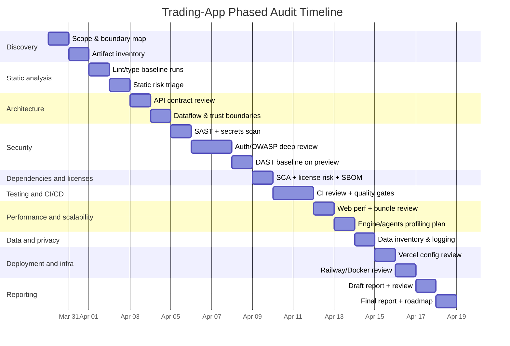

# Professional Phased Codebase Audit Plan for Trading-App

## Executive Summary

This report provides a professional, phased, “no-edits” audit and review plan for **stevenschling13/Trading-App**, updated to reflect your scope change (ignore the MNLEGIT651 repo). The plan is grounded in what the repository already contains: a pnpm + Turborepo monorepo, multi-service architecture (web + agents + engine), documentation-backed boundaries, and an unusually extensive CI/security/performance workflow suite. fileciteturn60file0L1-L1 fileciteturn14file0L1-L1 fileciteturn16file0L1-L1 fileciteturn36file0L1-L1 fileciteturn38file0L1-L1 fileciteturn65file0L1-L1

Enabled connectors were used first via `api_tool` as requested: **github** and **Vercel** were both accessible, and review-relevant artifacts were found (repository config + CI/workflows + deployment-related configs). fileciteturn17file0L1-L1 fileciteturn18file0L1-L1 fileciteturn41file0L1-L1

Key observations that affect audit design: the repository includes explicit production topology and environment ownership guidance (web on Vercel, engine and agents on Railway, browser “same-origin” proxy under `/api/*`), plus centralized timeout and upstream configuration. fileciteturn58file0L1-L1 fileciteturn59file0L1-L1

Unspecified items that materially affect audit depth and recommendations are: **target runtime environments** (beyond what’s implied by Docker/Vercel/Railway configs), **team size**, and **SLAs/SLOs**. These are called out explicitly in the reporting templates so the final audit artifacts remain professionally defensible.

## Connector coverage and repository snapshot

Enabled connectors (per your requirement) were:
- **github**
- **Vercel**

### What Trading-App is, structurally

Trading-App is a monorepo with:
- `apps/web`: Next.js dashboard (TypeScript) with security headers/CSP and middleware-based auth gating and rate limiting. fileciteturn60file0L1-L1 fileciteturn72file0L1-L1 fileciteturn73file0L1-L1  
- `apps/agents`: TypeScript service using Express, with `cors` and `jose` present (auth/token implications). fileciteturn26file0L1-L1  
- `apps/engine`: Python FastAPI quant engine with uvicorn/gunicorn and dev tooling via `ruff`/pytest, targeting Python 3.12+. fileciteturn28file0L1-L1 fileciteturn35file0L1-L1  
- `packages/shared`: shared TypeScript contracts for web/agents. fileciteturn27file0L1-L1  
- Ops/guardrails: CODEOWNERS, Dependabot grouping, extensive GitHub Actions workflows (CI, dependency review, scheduled security audits, coverage reporting, performance benchmarks, release workflow, workflow linting). fileciteturn62file0L1-L1 fileciteturn51file0L1-L1 fileciteturn36file0L1-L1 fileciteturn37file0L1-L1 fileciteturn38file0L1-L1 fileciteturn39file0L1-L1 fileciteturn65file0L1-L1 fileciteturn66file0L1-L1 fileciteturn40file0L1-L1

The build system is clearly pnpm workspaces + Turborepo (`pnpm-workspace.yaml`, `turbo.json`, root scripts). fileciteturn14file0L1-L1 fileciteturn16file0L1-L1 fileciteturn15file0L1-L1

### External services and security boundary implications

The env contract includes **entity["company","Supabase","backend-as-a-service"]**, **entity["company","Polygon.io","market data api"]**, **entity["company","Alpaca","broker api"]**, and **entity["company","Anthropic","ai api vendor"]** keys, plus internal `ENGINE_API_KEY` and routing URLs. fileciteturn31file0L1-L1 fileciteturn30file0L1-L1

The production topology states the browser must not call backends directly; traffic is proxied via same-origin Next.js route handlers under `/api/engine/*` and `/api/agents/*`, with engine/agents deployed separately (Railway configs exist for both). fileciteturn58file0L1-L1 fileciteturn55file0L1-L1 fileciteturn56file0L1-L1

This architecture strongly shapes how you should do security review and DAST: you must test both the public web origin and the upstream backends, but most web-facing risks should be concentrated at the Next.js edge and proxy handlers (auth, CSRF, SSRF, CORS, rate limiting, header forwarding, error normalization).

## Phased audit plan with artifacts, checks, tools, and time estimates

The phases below match your requested sequence (discovery → static analysis → architecture → security → dependency/license → testing/CI → performance/scalability → data/privacy → deployment/infra → reporting). Each phase lists (a) artifacts to collect, (b) concrete checks, and (c) prioritized commands.

image_group{"layout":"carousel","aspect_ratio":"16:9","query":["DevSecOps CI pipeline diagram GitHub Actions","OWASP Top 10 2021 diagram","Monorepo architecture diagram Turborepo","OWASP ZAP baseline scan GitHub Action diagram"],"num_per_query":1}

### Discovery

Artifacts to collect (repo + runtime posture):
- Repo map + boundaries: `README.md`, `docs/deployment.md`, `docs/ai/architecture.md`. fileciteturn60file0L1-L1 fileciteturn58file0L1-L1 fileciteturn63file0L1-L1  
- Configuration baseline: `package.json`, `pnpm-workspace.yaml`, `pnpm-lock.yaml`, `turbo.json`, `.nvmrc`, `tsconfig.base.json`. fileciteturn14file0L1-L1 fileciteturn16file0L1-L1 fileciteturn45file0L1-L1 fileciteturn70file0L1-L1  
- Env contract: `.env.example`, `ENV_SETUP.md` (document any “server-only” secrets vs browser-safe keys). fileciteturn31file0L1-L1 fileciteturn30file0L1-L1  
- Deployment configs: `vercel.json`, `.vercelignore`, `docker-compose.yml`, `apps/*/Dockerfile`, `apps/*/railway.toml`. fileciteturn17file0L1-L1 fileciteturn18file0L1-L1 fileciteturn32file0L1-L1 fileciteturn33file0L1-L1 fileciteturn34file0L1-L1 fileciteturn35file0L1-L1 fileciteturn55file0L1-L1 fileciteturn56file0L1-L1  

Concrete checks:
- Confirm “source of truth” for service topology and env ownership (docs vs implementation), and list explicit trust boundaries (browser, Next.js server runtime, engine, agents, database, 3rd parties). fileciteturn58file0L1-L1  
- Identify and inventory all authentication mechanisms (Supabase session, internal engine API key, any agent tokens), then define the audit threat model aligned to OWASP Top 10 categories. citeturn0search4

Prioritized commands (single reviewer):
```bash
git clone git@github.com:stevenschling13/Trading-App.git
cd Trading-App

node -v
cat .nvmrc
corepack enable && corepack prepare pnpm@10.32.1 --activate
pnpm -v

python3 --version
```

Time estimate: 0.5–1.0 day.

### Static analysis

Artifacts to collect:
- Lint/type tooling: `apps/web/eslint.config.mjs`, `tsconfig.base.json`, `apps/engine/pyproject.toml` (ruff config). fileciteturn50file0L1-L1 fileciteturn45file0L1-L1 fileciteturn28file0L1-L1  
- CI definitions that codify “what is enforced”: `.github/workflows/ci.yml`, `.github/workflows/workflow-lint.yml`. fileciteturn36file0L1-L1 fileciteturn40file0L1-L1  

Concrete checks:
- Confirm mismatch/coverage gaps between “lint scripts” and what CI enforces (example: web disables all `eslint-plugin-react` rules due to ESLint v10 compatibility; this may be acceptable temporarily but is a quality regression you should explicitly track as risk). fileciteturn50file0L1-L1  
- Validate “strictness posture”: TypeScript strict + `noUncheckedIndexedAccess` + `exactOptionalPropertyTypes` are strong professional defaults; ensure build/test paths exercise them. fileciteturn45file0L1-L1  

Prioritized commands:
```bash
pnpm install --frozen-lockfile

# Monorepo-wide (Node workspaces)
pnpm lint
pnpm test
pnpm build

# Web targeted
pnpm --filter @sentinel/web lint
pnpm --filter @sentinel/web test

# Agents targeted
pnpm --filter @sentinel/agents build
pnpm --filter @sentinel/agents test

# Engine targeted (Python)
cd apps/engine
pip install uv
uv venv .venv
uv pip install --python .venv/bin/python -e ".[dev]"
.venv/bin/python -m ruff check src tests
.venv/bin/python -m ruff format --check src tests
.venv/bin/python -m pytest tests --tb=short
```

Time estimate: 1.0 day.

### Architecture and API contract review

Artifacts to collect:
- Architecture contract docs and “sensitive files” list (used to drive targeted review): `docs/ai/architecture.md`, plus deployment topology doc. fileciteturn63file0L1-L1 fileciteturn58file0L1-L1  
- Centralized upstream configs/timeouts/retries: `apps/web/src/lib/server/service-config.ts`. fileciteturn59file0L1-L1  
- Middleware boundary logic: `apps/web/src/proxy.ts`. fileciteturn73file0L1-L1  
- Shared contract package: `packages/shared/*` and where it’s consumed. fileciteturn27file0L1-L1  

Concrete checks:
- Verify the “single public origin” invariant: browser calls must remain same-origin; confirm proxy routes prevent leaking upstream URLs to the client and that no deprecated `NEXT_PUBLIC_*ENGINE*` fallback remains for production. fileciteturn58file0L1-L1  
- Check API contracts for drift: shared types should represent stable request/response shapes (especially around trading/backtest/risk). Confirm versioning strategy (URI versioning vs schema evolution) and document breaking-change policy. fileciteturn63file0L1-L1  
- Review state management and error normalization boundaries (web store, health hooks, offline UX) so operational failure modes don’t become security vulnerabilities (e.g., “silent fallback” that bypasses auth). fileciteturn63file0L1-L1  

Prioritized commands:
```bash
# Confirm turbo graph + task config is coherent
cat turbo.json
pnpm -w run build --dry-run || true

# Fast “architecture grep” to locate boundary points
rg -n "ENGINE_URL|AGENTS_URL|ENGINE_API_KEY|Authorization" apps/web apps/agents apps/engine
rg -n "/api/engine|/api/agents" apps/web
rg -n "CORS|cors" apps/agents apps/engine
```

Time estimate: 1.0–2.0 days.

### Security review

Security review should be explicitly mapped to OWASP Top 10 (risk framing) and OWASP ASVS (control verification checklist). citeturn0search4 citeturn0search0

Artifacts to collect:
- AppSec headers + CSP: `apps/web/next.config.ts`. fileciteturn72file0L1-L1  
- Auth gate + API route behavior: `apps/web/src/proxy.ts`. fileciteturn73file0L1-L1  
- Secrets surface area: `.env.example`, `turbo.json` env pass-through list (verify secrets are not exposed client-side). fileciteturn31file0L1-L1 fileciteturn15file0L1-L1  
- Existing security automation: `.github/workflows/security-safety.yml`, `scripts/security-audit.mjs`, `.github/workflows/dependency-review.yml`. fileciteturn38file0L1-L1 fileciteturn52file0L1-L1 fileciteturn37file0L1-L1  

Concrete checks (what to review, and why):
- Authn/Authz: validate session handling, protected route classification, and API route behavior (JSON 401 vs HTML redirects). Broken Access Control is OWASP A01; auth failures map to A07. fileciteturn73file0L1-L1 citeturn0search4  
- CSRF: confirm state-changing operations use safe patterns (synchronizer tokens, double-submit cookies, or Fetch Metadata), and ensure cookies have correct SameSite/Secure/HttpOnly posture where applicable. citeturn3search0  
- Injection/XSS: verify CSP is enforced and does not over-broaden `script-src`; confirm untrusted data is encoded/validated at boundaries. (CSP exists, but still requires code review for templating and untrusted HTML usage.) fileciteturn72file0L1-L1 citeturn0search4  
- SSRF: proxy routes to engine/agents must restrict target base URLs (especially in production) to prevent attacker-controlled upstreaming; confirm “no localhost” in production is enforced. fileciteturn58file0L1-L1 fileciteturn59file0L1-L1 citeturn0search4  
- CORS + rate limiting: ensure CORS policy is least-privilege and rate limiting is applied on the correct surface (public origin vs internal services). The middleware rate-limit hook is present; verify it covers the risk endpoints and keys correctly. fileciteturn73file0L1-L1  
- Secrets management: confirm no secrets are compiled into front-end bundles; explicitly verify build-time vs runtime env handling (e.g., service-role keys must never reach client). fileciteturn31file0L1-L1 fileciteturn72file0L1-L1  

Tools and commands (SAST + secrets + DAST), prioritized:
```bash
# Existing in-repo security checks
node scripts/security-audit.mjs

# Examples you should add to the audit runbook (even if not yet in CI)

## Secrets scanning (local + CI)
gitleaks detect --source . --redact
# or GitHub Action usage (recommended) per official gitleaks-action docs:
# uses: gitleaks/gitleaks-action@v2

## SAST
# CodeQL: enable via GitHub "default setup" (recommended) or add a workflow.
# GitHub docs cover default setup and CodeQL-supported languages.
# Semgrep (open-source mode):
semgrep scan --config p/owasp-top-ten --error || true

## DAST (baseline passive scan against preview/prod URL)
# zaproxy/action-baseline in GitHub Actions is the most frictionless.
# Local example:
docker run --rm -t ghcr.io/zaproxy/zaproxy:stable zap-baseline.py \
  -t https://YOUR_PREVIEW_OR_PROD_URL \
  -r zap_report.html
```

Primary references for these tools/standards:
- OWASP Top 10 risk categories. citeturn0search4  
- OWASP ASVS as a verification standard for technical controls. citeturn0search0  
- GitHub code scanning / CodeQL default setup. citeturn1search1  
- ZAP baseline scan GitHub Action. citeturn4search0  
- Gitleaks GitHub Action usage baseline. citeturn11search1  

Time estimate: 2.0–3.0 days.

### Dependency and license review

Artifacts to collect:
- Dependency manifests: `pnpm-lock.yaml`, `apps/*/package.json`, `apps/engine/pyproject.toml`. fileciteturn24file21L1-L1 fileciteturn25file0L1-L1 fileciteturn26file0L1-L1 fileciteturn28file0L1-L1  
- Automation posture: Dependabot config and dependency review workflow. fileciteturn51file0L1-L1 fileciteturn37file0L1-L1  
- Existing repo audit script (pnpm audit + pip-audit). fileciteturn52file0L1-L1  

Concrete checks:
- Vulnerable and outdated components are explicitly OWASP A06; treat this as an always-on program, not a one-time audit. citeturn0search4  
- Confirm the “allowed exceptions” list (e.g., ignored CVEs) has justification and review cadence. fileciteturn52file0L1-L1  
- License risk: identify copyleft exposure, “no commercial use” licenses, and transitive license incompatibilities; produce an SBOM for audit traceability.

Tools and commands:
```bash
# Node SCA (existing approach already in repo audits)
pnpm audit --prod --audit-level=high

# Python SCA (existing approach)
cd apps/engine
.venv/bin/python -m pip_audit --desc

# Add SBOM generation for professional-grade traceability
# Syft (SBOM generator):
syft scan dir:. -o spdx-json=sbom.spdx.json -o cyclonedx-json=sbom.cdx.json

# Container scanning for Docker images (if you build images in CI)
# Trivy example:
trivy image --severity HIGH,CRITICAL your-image:tag
```

Primary references:
- Snyk Open Source and `snyk test` for vulnerability + license issues (useful in addition to pnpm audit). citeturn1search2  
- Syft SBOM guidance. citeturn9search2  
- Trivy image scanning command reference. citeturn9search7  

Time estimate: 1.0 day.

### Testing, CI/CD, performance, data/privacy, deployment/infra, and reporting

Because Trading-App already has CI, coverage reporting, performance workflows, release automation, and Vercel deployment checks, your audit should focus on “are these checks sufficient, correctly scoped, and enforceable as quality gates?” rather than “do we have CI at all?”. fileciteturn36file0L1-L1 fileciteturn39file0L1-L1 fileciteturn65file0L1-L1 fileciteturn66file0L1-L1 fileciteturn41file0L1-L1

This is where professional teams typically introduce formal “quality gating,” such as SonarQube quality gates (pass/fail policy on new code). citeturn2search0

A concise time/ownership breakdown (single reviewer default):

| Phase | Core deliverable | Single-reviewer effort |
|---|---|---|
| Discovery | System boundary map + audit scope | 0.5–1.0 day |
| Static analysis | Lint/type/test baseline + gaps | 1.0 day |
| Architecture | Contract review + drift list | 1.0–2.0 days |
| Security | Threat model + SAST/DAST/secrets results | 2.0–3.0 days |
| Dependency/license | SCA + license risk + SBOM | 1.0 day |
| Testing/CI/CD | CI sufficiency + gating plan | 1.0–2.0 days |
| Performance/scalability | Perf + load test plan + hotspot list | 1.0–2.0 days |
| Data/privacy | Data inventory + retention + logging review | 0.5–1.0 day |
| Deployment/infra | Vercel/Railway/Docker verification | 1.0–2.0 days |
| Reporting | Final report + prioritized roadmap | 1.0 day |

Total: ~10–15 business days depending on depth and how much runtime access (logs/observability dashboards) you include.

Mermaid Gantt timeline (example plan, adjust based on availability and audit depth):


## Current methods vs professional best practices

Your current setup is already significantly closer to a “professional engineering baseline” than most solo repos: it has multi-job CI, scheduled security audits, dependency review, coverage and performance workflows, release automation, CODEOWNERS, Dependabot grouping, and a devcontainer. fileciteturn36file0L1-L1 fileciteturn38file0L1-L1 fileciteturn37file0L1-L1 fileciteturn39file0L1-L1 fileciteturn65file0L1-L1 fileciteturn66file0L1-L1 fileciteturn62file0L1-L1 fileciteturn51file0L1-L1 fileciteturn61file0L1-L1

The optimizations below are what typically differentiate “good personal project” from “professional-grade production system with provable controls,” aligned to entity["organization","NIST","sp 800-218 ssdf"] SSDF (secure SDLC) and OWASP verification practices. citeturn6search1turn0search0

### Comparative table: where you are vs “professional baseline”

| Domain | Current evidence in Trading-App | Professional baseline | Concrete optimization |
|---|---|---|---|
| Secure SDLC standard | Docs define topology, env ownership, and boundaries. fileciteturn58file0L1-L1 | Explicit mapping to SSDF/SAMM practices in policy docs. citeturn6search1turn5search1 | Add an “Audit Controls Mapping” appendix mapping your CI/security checks → SSDF tasks and/or OWASP ASVS sections. citeturn0search0 |
| SAST | Present: repo script runs pnpm audit + pip-audit + workflow permission checks. fileciteturn52file0L1-L1 | Code scanning for code-level vulnerabilities (CodeQL or equivalent) on PRs/main. citeturn1search1 | Enable GitHub CodeQL default setup (fastest) or add CodeQL workflow for TS/JS + Python. citeturn1search1 |
| Secrets scanning | Env docs exist; no dedicated secrets scanner workflow found. fileciteturn31file0L1-L1 | Secret scanning in CI + pre-commit (Gitleaks). citeturn11search1 | Add gitleaks-action on PR/push + local `gitleaks protect` hook. citeturn11search1 |
| DAST | No DAST workflow present. | Baseline DAST (ZAP) against preview deployments for regressions. citeturn4search0 | Add ZAP baseline workflow targeting Vercel preview URL; maintain `.zap/rules.tsv` to control noise. citeturn4search0 |
| Monorepo deploy efficiency | Vercel config defines build command and ignore command. fileciteturn17file0L1-L1 | Use platform-native “skip unaffected projects” where possible. citeturn0search1 | Validate whether Vercel monorepo “skipping unaffected projects” can replace custom ignore logic. citeturn0search1 |
| Quality gating | CI runs lint/tests/build; coverage/perf are informative (some continue-on-error). fileciteturn36file0L1-L1 fileciteturn39file0L1-L1 fileciteturn65file0L1-L1 | Enforced pass/fail “quality gate” (e.g., SonarQube) for new code. citeturn2search0 | Adopt a gate policy: “no new high/critical vulns + minimum coverage on new code + no new blocker issues.” citeturn2search0 |
| Supply-chain hygiene | Dependabot + dependency review already in place. fileciteturn51file0L1-L1 fileciteturn37file0L1-L1 | Add Scorecard/SBOM publication to strengthen provenance posture. citeturn6search0turn9search2 | Add OpenSSF Scorecard action + build SBOM artifacts per release. citeturn6search0turn9search2 |
| Web security headers | CSP/HSTS/XFO/etc configured in Next config. fileciteturn72file0L1-L1 | Continuous validation (DAST + header checks) and minimal CSP exceptions. citeturn0search4 | Add a CI smoke check to assert key headers exist on deployed preview. |
| Auth surface | Middleware enforces auth and returns JSON 401 for API routes. fileciteturn73file0L1-L1 | Explicit CSRF posture, secure cookie posture, and documented token handling. citeturn3search0 | Add an “Auth & Session Security” doc section: CSRF strategy, cookie settings, token storage, refresh behavior. citeturn3search0 |

### Priority “professionalization” optimizations list

Ordered by highest risk-reduction / lowest friction first:

1. Enable GitHub CodeQL code scanning (default setup) for TS/JS and Python to catch common vulnerability classes earlier than manual review. citeturn1search1  
2. Add Gitleaks scanning in CI (and optionally pre-commit) to reduce catastrophic secret leakage risk. citeturn11search1  
3. Add baseline DAST with OWASP ZAP against Vercel preview deployments to catch regressions in headers, injection signals, auth misconfigurations, and accidental exposures. citeturn4search0  
4. Add SBOM generation (Syft) and container scanning (Trivy) to strengthen supply-chain and release traceability. citeturn9search2turn9search7  
5. Introduce a formal quality gate policy (SonarQube or equivalent) focusing on “clean as you code” on new code, rather than boiling the ocean. citeturn2search0  
6. Adopt OpenSSF Scorecard Action to measure and continuously improve repo security health posture. citeturn6search0  

## Reporting templates, severity scoring, and risk prioritization

Professional audits succeed or fail based on reporting quality: consistent severity, clear evidence, actionable remediation, and explicit assumptions. The templates below are designed to produce a final report that holds up in professional review.

### Severity scoring model

Use CVSS v3.1 concepts for vulnerability severity communication, but keep execution operationally simple (especially for a solo reviewer). citeturn5search0

Recommended fields:
- **Impact**: Confidentiality / Integrity / Availability (Low/Med/High)
- **Exploitability**: Attack vector (remote/local), auth required, user interaction, complexity
- **Exposure**: Internet-facing? Authenticated-only? Internal-only?
- **Confidence**: Low/Med/High (how certain the finding is real)

Suggested severity buckets (CVSS-like mapping, but not a full calculator):
- **Critical**: remote exploit + high impact + likely (e.g., auth bypass, secret exposure)
- **High**: significant impact or likely exploit path
- **Medium**: moderate impact, mitigations exist, or requires conditions
- **Low**: best-practice gaps, hard-to-exploit, low impact
- **Info**: observations, no direct risk

### Finding template

Use this as the canonical unit in the audit report:

**Finding ID**: SEC-WEB-001  
**Title**: (Short, specific)  
**Component**: web / agents / engine / shared / infra / CI  
**Category**: OWASP Top 10 mapping (e.g., A01 Broken Access Control) citeturn0search4  
**Evidence**: file path(s), config excerpt reference, reproduction steps  
**Impact**: (C/I/A) + business consequence  
**Exploit scenario**: 2–5 sentences, concrete  
**Severity**: Critical/High/Medium/Low/Info (with confidence)  
**Remediation**: stepwise, smallest safe change first  
**Verification**: exact command / test / scan that should go green  
**Owner**: (default single reviewer; or team role if known)  
**ETA**: 0.5d / 1d / 1w (rough order-of-magnitude)

### Risk register template

This is what you hand to stakeholders:

| Risk | Severity | Likelihood | Affected surface | Control gap | Recommended fix | Target date |
|---|---|---|---|---|---|---|

Tie “control gap” to SSDF practice areas for professional traceability. citeturn6search1

### Sample final report section outline

This is the structure to use when you execute the audit:

- Executive summary (top risks, quick wins, timeline)
- Scope and assumptions (explicitly list runtime/team/SLA unknowns)
- System overview (architecture, trust boundaries, integrations)
- Findings (grouped by component: web/engine/agents/CI/infra)
- Risk register and remediation roadmap (phased)
- Appendix: commands run, tool versions, scan outputs, SBOM links/artifacts

### Limitations

This plan assumes you can run the repo locally and (for DAST) have at least one preview/prod URL to scan. Items like performance and privacy posture become more accurate if you can provide runtime logs/metrics and real traffic patterns. Formal SLA/SLO validation is not possible without explicit targets and monitoring/incident history, which were not specified.

The file_search connector was not available for GitHub sources in this environment, so repository evidence was gathered through connector-based file retrieval and should be re-verified during execution by cloning locally and reproducing scans end-to-end.