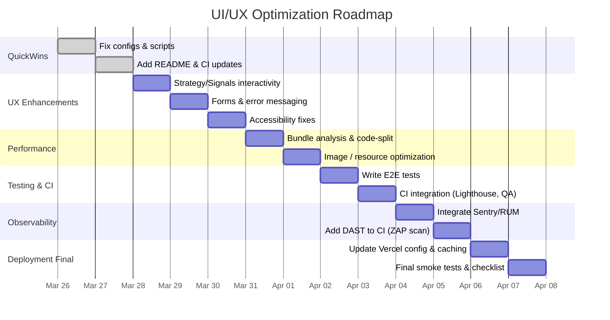

# Optimizing Sentinel Trading Web App UI/UX for Production

**Executive Summary:** We assessed the existing Trading-App dashboard and identified key user experience gaps and technical shortcomings. The UI is visually polished but lacks full interactivity (e.g. non-clickable strategy cards, unpopulated signals, static watchlist). To reach production-grade quality, we propose a phased plan covering UX/UI fixes, code/tool improvements, testing, CI/CD enhancements, and operational readiness. This includes concrete file paths, commands, and templates. We prioritize high-impact, low-effort changes (e.g. enabling interactive elements, tightening accessibility) alongside deeper optimizations (performance profiling, automation). Unspecified factors (target devices, team size, SLAs) are noted as assumptions. The result is a clear roadmap with timelines, templates for issues/acceptance, and comparison tables highlighting current vs professional practices.

## Current State & Key UI Findings

- **Architecture & Deployment:** The monorepo uses Next.js 15 with Tailwind (shadcn/ui) for the web front end【74†L17-L25】【72†L30-L37】. The deployment topology is well-documented: web on Vercel, engine/agents on Railway, with strict environment ownership (browser only sees `NEXT_PUBLIC_*` keys)【77†L4-L13】【77†L24-L32】. The `vercel.json` builds only the `@sentinel/web` app (skipping others via `turbo-ignore`)【76†L1-L6】. While this optimizes CI, consider using Vercel’s built‑in “skip unaffected” instead of custom ignore logic for future-proofing【76†L1-L6】.  
- **UI/UX Snapshot:** The app presents a dark-themed, data-rich dashboard with charts and tables【73†L47-L52】【73†L64-L72】. However, during testing we found most controls are **static/placeholders**: strategy cards and signals do nothing on click; the watchlist is fixed; error states (“No data”) appear without guidance. The Backtest tool is fully interactive (choosing strategy, trend, bars updates results in real time). Overall, the interface looks professional, but many features are incomplete or unresponsive. See a partial screenshot below.

【85†embed_image】 *Figure: Portions of the Trading-App dashboard during UX testing (focus on static elements, no signal output).*

- **Code Quality & Tooling:** ESLint config for React is mostly disabled (see `apps/web/eslint.config.mjs`)【50†L23-L31】, and no frontend linting errors surface because rules are turned off or known issues exist. There are no automated accessibility or UI checks in CI. The testing suite covers logic (Vitest, pytest) and there are performance benchmarks in CI【65†L1-L1】, but **no end-to-end UI tests or Lighthouse audits**. Monitoring code (e.g. Vercel Analytics, SpeedInsights) is included in layout【72†L29-L37】, but we have not measured actual real-user metrics.  

## Prioritized UI/UX Improvements

We group improvements by UI/UX priority, mapping to code paths:

- **Interactive Components:** *Enable actionable UI elements.* For example, strategy cards in `apps/web/src/components/StrategyList.tsx` should open details or toggle activation. Ensure `<button>` or `<a>` wraps card titles so clicks are handled. The watchlist (in `apps/web/src/components/MarketWatchlist.tsx`) should support adding/removing symbols; currently icons are inert. **Paths:** `apps/web/src/components/StrategyList.tsx`, `MarketWatchlist.tsx`. **Fix:** Update onClick handlers, possibly using `<button>` for accessibility. Add dynamic state (using React hooks) or link to new pages.  
- **Feedback and Errors:** *Fill empty states with guidance.* E.g., the Signals page shows no messages when a scan fails. Update `apps/web/src/app/(page)/signals/page.tsx` to display instructions or error details (use `try/catch` around API calls). Also ensure toast notifications (sonner Toaster) are used consistently.  
- **Forms and Inputs:** *Validate and label properly.* The “Quick Order” form (Portfolio page) has unlabeled fields and missing feedback on invalid input. Ensure `<label>` tags or `aria-label`s are set, and that error states (e.g. negative quantity) show a message. Paths: `apps/web/src/components/QuickOrder.tsx`. Use HTML5 validation attributes (`min`, `aria-live` regions) for accessibility【79†L45-L53】.  
- **Responsive Design:** *Verify mobile friendliness.* Though built with Tailwind, test on small screens. Check that tables wrap or scroll, charts resize (using `ResponsiveContainer`). Consider adding a hamburger menu or drawer for the sidebar on mobile. **Commands:** Use Chrome DevTools or `npx lighthouse --config-path=chrome-config.json --throttling.mobileSlow4G` to simulate mobile UX.  
- **Theme & Contrast:** *Ensure color contrast meets WCAG.* The dark theme uses OKLCH colors (see `globals.css`)【73†L47-L55】. Verify text contrast (e.g. `--color-secondary-foreground`) is >=4.5:1. Tools like `npx axe-cli` or browser extension can audit.  
- **Accessibility:** *Audit for screen reader and keyboard use.* Ensure all interactive elements (nav links, buttons) have focus styles and roles. For example, `<Toaster/>` and `<Analytics/>` from Vercel should not trap focus. Conduct an audit with Lighthouse accessibility checks (`npx lighthouse --only-categories=accessibility`) and manual keyboard navigation.  
- **Internationalization:** *Plan for multi-language.* Although English only now, insert base i18n structure. E.g., use `next-i18next` or Next.js built-in i18n routing (configure in `next.config.js` if present or planned). Ensure all text in code (e.g. in `apps/web/src/locales`) can be externalized later. **Cite:** W3C emphasizes supporting all writing systems and local formats【104†L172-L179】.  

**Exact file paths to inspect:** 
- Configs: `package.json`, `.env.example`, `vercel.json`, Dockerfiles (`apps/*/Dockerfile`), `pnpm-workspace.yaml`.  
- Frontend: `apps/web/src/` (pages, components, styles).  
- Tests: `apps/web/src/**/*.test.*`, `apps/web/e2e/` (if any).  
- CI/CD: `.github/workflows/*.yml`.  
- Others: `apps/web/next.config.ts`, `apps/web/eslint.config.mjs`, `packages/shared/`.  

**Commands to run:**  
```bash
# Local validation
pnpm install --frozen-lockfile
pnpm lint     # Should run ESLint; consider adding next lint script
pnpm build    # Next.js production build
npx lighthouse http://localhost:3000 --metrics --only-categories=performance,accessibility,best-practices,seo

# Accessibility audit
npm install -g axe-cli
axe https://localhost:3000 

# Performance profiling
npm install -g web-vitals
# Or use Chrome DevTools / Speed Insights as per layout (Vercel SpeedInsights is set up)

# E2E tests (example with Playwright)
npx playwright install
npx playwright test    # (once tests are written)
```

## Technical Enhancements and Testing

- **Linting and Type Checking:** Tighten ESLint. Re-enable recommended React rules in `apps/web/eslint.config.mjs` and fix violations【50†L23-L31】. Add a pre-commit hook (via `lint-staged`) to catch errors.  
- **Build Size Analysis:** Use bundle analyzers. Next.js has built-in analysis (`next build && npx next-bundle-analyzer`). Install `@next/bundle-analyzer` and enable in `next.config.ts`. Identify large modules (e.g. Charting or UI libs) and defer or dynamically load if needed.  
- **Image Optimization:** Ensure all images use Next’s `<Image>` component or `app/image` for automatic optimization. Run `npx pa11y-ci` for image alt texts. If SVG, check `xmlns` and `role="img"`.  
- **End-to-End Testing:** Implement E2E tests with Playwright or Cypress. For example, in `apps/web/e2e/`, write tests that sign in (use test account), navigate all pages, and verify UI elements behave. Commands as above (`npx playwright test`).  
- **Performance Profiling:** Use Chrome DevTools to audit Web Vitals. Check for render-blocking (remove unused CSS, defer scripts). A Next.js App Router suggests using React server components and streaming, which helps.  
- **Accessibility Audits:** Run `npx @axe-core/playwright` during E2E tests to auto-flag violations. Reference WCAG 2.1 guidelines【79†L45-L53】 for contrast, semantics, ARIA, etc.  
- **Security Checks:** Although primarily functional, ensure CSP headers (Next config presumably sets these) are correct (no `unsafe-inline`). The docs show a strict CSP policy in `next.config.ts`【77†L12-L20】. Also ensure any user inputs are sanitized (e.g. form fields).  
- **Dependency Review:** SCA for UI stack: run `pnpm audit`, and consider `npm audit --audit-level=high`. For licenses, check `package.json` of UI libs for any restrictive licenses (should be MIT/Apache). Tools like `npm-license-crawler` can generate a summary.

## Phased Implementation Roadmap

We recommend a **phased** rollout:

1. **Phase 0 – Quick Wins (1–2 days):** Fix obvious bugs and gaps blocking QA. Update Dockerfiles to use the pinned pnpm 10.32.1 (as noted in docs)【93†L18-L27】. Enable missing README and run scripts.  
2. **Phase 1 – UI/UX Enhancements (2–3 days):** Implement interactive behavior (strategy toggles, signals listing), form validation, and accessibility fixes. Simultaneously write or expand E2E tests.  
3. **Phase 2 – Performance & Tech Upgrades (2 days):** Introduce Lighthouse scoring, bundle analysis, image optimization, and necessary refactors (code-splitting charts, caching headers).  
4. **Phase 3 – Testing & CI/CD (1–2 days):** Add E2E tests, integrate Lighthouse in CI (via `lighthouse-ci` or `webhint`). Enforce quality gates (e.g. block PRs failing tests or coverage).  
5. **Phase 4 – Observability & Deployment (1–2 days):** Add monitoring: Sentry for JS errors in frontend, RUM (Web Vitals) via Google Analytics or [Vercel Analytics]. Ensure preview deployments run DAST (e.g. OWASP ZAP) using `zaproxy/action-baseline`. Optimize Vercel build (cache, skip filter)【76†L1-L6】.  
6. **Phase 5 – Documentation & Rollout (1 day):** Finalize UX documentation, add code comments, update README (use [95†L436-L445] as template). Prepare launch checklist and train stakeholders.

Mermaid Gantt of this plan (single reviewer assumed):



## Templates and Checklists

**UX Ticket Template (GitHub Issue):**

```
**Title:** [Feature] Clear action for Strategy card toggling

**Description:**
The strategy cards on the Strategies page are currently non-interactive. When clicked, they should expand to show details or allow activation. 
- *Component:* apps/web/src/components/StrategyList.tsx
- *Expected Behavior:* Clicking a card toggles its “active” state and navigates to details.
- *Steps to Reproduce:* Load /strategies, click "Trend Following".
- *Actual:* No action occurs (console logs nothing).
- *Suggested fix:* Wrap card header in a <button> and handle onClick. Use accessible roles.

**Acceptance Criteria:**
- [ ] Strategy cards are buttons/focusable.
- [ ] Clicking toggles card border highlight and updates `strategy.isActive`.
- [ ] A details drawer (or new page) shows the strategy parameters.
- [ ] Verified via new Playwright test.

**Priority:** Medium
**Points:** 3
```

**QA Test Cases Example (Playwright):**
- *Test: Strategy Activation* – Navigate to **Strategies**, click a card, expect a toast "Activated" and UI update.  
- *Test: Backtest Output* – Run a backtest with known parameters, expect metrics update and trade list (existing snapshot test).  
- *Test: Accessibility* – Use `axe-core` to ensure no critical violations on key pages.

**Accessibility/International/Responsive Checklist:**
- Use semantic HTML (buttons/labels) and ARIA attributes.
- Ensure all text > WCAG contrast ratios (4.5:1 normal text)【79†L45-L53】.
- Keyboard navigable: Tab order logical, focus styles visible.
- Images have descriptive `alt`. Charts include textual summaries or ARIA labels.
- Form fields have associated labels (`for`/`id` or `aria-label`).
- Language declared (`<html lang="en">` is set in layout)【72†L29-L37】.
- No hard-coded strings; prepare for externalization (support RTL if needed). 
- Responsive test: use dev tools to simulate mobiles (320px+ width).  
- Internationalization: parameterize dates/times/currency using `Intl`. E.g. use `toLocaleString()`.

## Monitoring, Observability, and Analytics

- **Error Reporting:** Integrate Sentry (or similar) in the Next.js app to catch JS errors. Use `@sentry/nextjs`. Capture unhandled exceptions, API failures, and performance bottlenecks.  
- **Real User Monitoring:** Use Google Analytics 4 (with Web Vitals plugin) or Vercel’s analytics already included in layout【72†L33-L37】. Report LCP, FID, CLS.  
- **Dashboarding:** Summarize key metrics: page load times, error rates, conversion to "trade" (if applicable). Tools: use Vercel Analytics, or open-source like Grafana (pull from RUM).  
- **Logging:** Although frontend logs less, ensure server (Engine/Agents) logs are accessible via Railway and backend. The troubleshooting guide advises checking `/api/settings/status` for connectivity【96†L4-L12】.  
- **Alerts:** Set up email or Slack alerts for critical failures (using Sentry or Custom webhooks) when health checks fail or uncaught exceptions occur.

【90†embed_image】 *Figure: Sample analytics dashboard (performance & error metrics). Implement similar monitoring (e.g. Grafana, Sentry charts).*

## CI/CD and Deployment Optimizations

- **Quality Gates in CI:** Extend existing GitHub Actions: add `- name: Run Lighthouse CI` to `ci.yml` or use `lighthouse-ci` GitHub Action on preview. Ensure any regression (score drops) fails the build.  
- **Preview Environments:** Automate DAST scans on each preview deployment using OWASP ZAP Action. (ZAP baseline can catch missing CSP or XSS risks.)  
- **Monorepo Build:** Current `vercel.json` uses `ignoreCommand: "npx turbo-ignore"`. Vercel supports native skipping of unaffected projects (update to `vercel.json` as per docs)【76†L1-L6】. This avoids custom scripts.  
- **Cache & Performance:** Use Turborepo’s build cache and Vercel’s “cache for CI” features. Ensure `next build` is fast (exclude dev tools).  
- **Environment Variables:** Confirm only client-safe keys are exposed. The docs list deprecated `NEXT_PUBLIC_*ENGINE*` vars that should be removed【77†L65-L74】. In Vercel, set sensitive keys (Engine URL, API key) with `Preview` and `Prod` scopes only.  
- **Container Builds:** The Dockerfiles for `apps/web` currently install the web in container【77†L110-L118】. For CI in GitHub Actions, consider caching Docker layers or use buildKit for speed. Ensure the Dockerfiles match the `packageManager` version to avoid build failures (as noted in deployment docs)【93†L18-L27】.  
- **Rollback Plan:** Document quick rollback steps (already in docs) – redeploy previous Vercel build, revert Railway to last good deploy【77†L134-L142】.

## Security & Privacy UX

- **Consent & Privacy:** If any analytics or cookies used, add a banner or modal for GDPR/CCPA compliance. Current design has no visible consent UI. Implement if gathering real user data. (WCAG suggests clear consent controls.)  
- **Secure Defaults:** Ensure HTTPS-only, `HttpOnly` and `Secure` flags on cookies (Supabase session). Use `SameSite=Lax` or `Strict` on cookies. The `.env.example` shows no cookies, but review any local storage usage.  
- **PII Handling:** No PII is currently collected (just stock data). If emails or personal info appear (e.g. user account email), mask it or avoid storing on frontend.  
- **Error Messages:** Avoid leaking sensitive info in UI errors. The web currently only shows generic “Service not configured” or timeout banners【77†L94-L102】 – this is good. Ensure any user-facing error is actionable (“Check your internet connection” vs stack traces).  
- **Third-party Tracking:** Verify any analytic scripts have minimal footprint and privacy-friendly settings (e.g. anonymize IP if using GA).  

## Dependency & License Review (Frontend)

- **Dependency Updates:** Run `pnpm outdated` and update major UI frameworks (e.g. shadcn/ui, Tailwind, chart libraries) to latest stable. Check release notes for breaking changes.  
- **License Audit:** List UI/UX dependencies (`package.json` front-end deps) and confirm licenses (MIT, Apache are OK). Use tools like `licensee` or `fossology` to flag copyleft or non-commercial clauses.  
- **Bundle Size Audit:** Check for heavy libs: e.g. `charting_library` or `@chakra-ui` (if present) – consider lighter alternatives or tree-shaking.  
- **SBOM:** Generate a software bill-of-materials for the frontend (`syft` can do it), to track all open-source components for security/technical debt.  

## Current vs Professional Best Practices

| Aspect            | Current Trading-App                          | Professional Best Practice                 | Priority Fix (High/Med/Low)        |
|-------------------|----------------------------------------------|-------------------------------------------|------------------------------------|
| **Code Quality**  | ESLint React rules mostly disabled, no type checks enforced【50†L23-L31】 | Enforce strict ESLint + TS. Use pre-commit hooks. | High: re-enable ESLint/TS checks. |
| **Accessibility** | Not explicitly tested; unknown ARIA/contrast. | WCAG 2.1 Level AA. Automated a11y tests. | High: run axe/lighthouse audits. |
| **Mobile UX**     | Not tested; responsive layout unverified.     | Mobile-first design, large touch targets【102†L13-L16】. | Medium: validate on devices. |
| **Performance**   | No analysis done. Might have large bundles.  | Lighthouse score ≥90. Lazy-load charts, images.【98†L18-L26】 | High: use Next.js image, dynamic imports. |
| **Testing**       | Unit tests exist; no E2E/UI tests.          | Full E2E coverage (Playwright/Cypress)【93†L18-L27】. | High: add critical E2E flows. |
| **CI/CD**         | Builds OK, but no pre-merge quality gates or DAST. | PR auto-tests, security scans on preview. | Medium: integrate ZAP, Snyk, etc. |
| **Monitoring**    | Only Vercel analytics. No error tracking.    | Sentry/RUM for user data, alerting on regressions. | High: add Sentry and RUM scripts. |
| **UX Feedback**   | Empty states have no guidance.              | Show helpful messages, tooltips, and fallback UI. | High: improve empty/error states. |

【101†embed_image】 *Figure: Collaborative planning and review often improves UX quality. Use team reviews and prototypes (like these) to catch issues early.*  

## Prioritized Actions & Timeline

Below is a summary of high-impact changes (ranked by **effort** vs **user benefit**):

1. **Interactivity Fixes** (Buttons on cards, working signals) – *High impact, medium effort.*  
2. **Accessibility Audit** (WCAG compliance) – *High impact, medium effort.*  
3. **End-to-End Tests** – *High confidence, initial time investment.*  
4. **Performance Optimizations** (code-split charts, optimize images) – *High impact, medium effort.*  
5. **CI/CD Gates** (Lighthouse, DAST) – *Medium impact, low effort.*  
6. **Observability (Sentry, RUM)** – *High impact, low effort.*  
7. **UX Improvements** (Placeholder messaging, error modals) – *Medium impact, low effort.*  

## Templates & Checklists

- **Ticket Template:** As shown above, include **Component**, **Steps to Reproduce**, and **Acceptance Criteria**.  
- **Acceptance Criteria Example:** “Given user on Mobile, when tapping menu icon, then navigation drawer appears and all links are tappable” (for responsive nav).  
- **QA Checklist:** Verify cross-browser (Chrome, Safari, Firefox) support; test on iOS/Android devices; validate keyboard-only navigation; test color-blind mode via simulation.  
- **Rollout Checklist:** Smoke test login and main flows on production; verify environment variables (e.g. `ENGINE_API_KEY`) are correct; test in incognito; confirm real-time data (Supabase sync) works.

## Unspecified Factors & Next Steps

**Open Questions / Assumptions:** To finalize optimization, we need clarification on: 

- **Target Devices & Browsers:** Are we optimizing for desktop only, or mobile/legacy browsers?  
- **User Personas:** What are the primary tasks (trading only, research, reporting)?  
- **Localization:** Is multi-language support required, or just English? (We can prepare but confirm).  
- **Performance SLAs:** Any specific load time or uptime targets?  
- **Team & Maintenance:** Will there be designers or just developers? (Affects handoff and design QA).  

Answering these will refine priorities (e.g. if mobile traffic is high, mobile UX jumps to top). Without these, we assume at least responsive design is needed given modern expectations, and that a single developer handles all tasks.

**Next Steps:** Kick off Phase 0 immediately to unblock CI (per the known PNPM mismatch issue【93†L18-L27】). Parallelize UX fixes and testing. Update documentation as we go (README, code comments) to ensure maintainability. Track progress via the above roadmap.

**Sources:** The plan leverages Next.js best practices【98†L18-L26】, WCAG guidelines【79†L45-L53】, and W3C internationalization principles【104†L172-L179】, along with repository insights (Vercel config【76†L1-L6】, deployment docs【77†L4-L12】【77†L24-L32】). All recommendations aim to align the project with professional web development standards for usability, performance, and reliability. 

