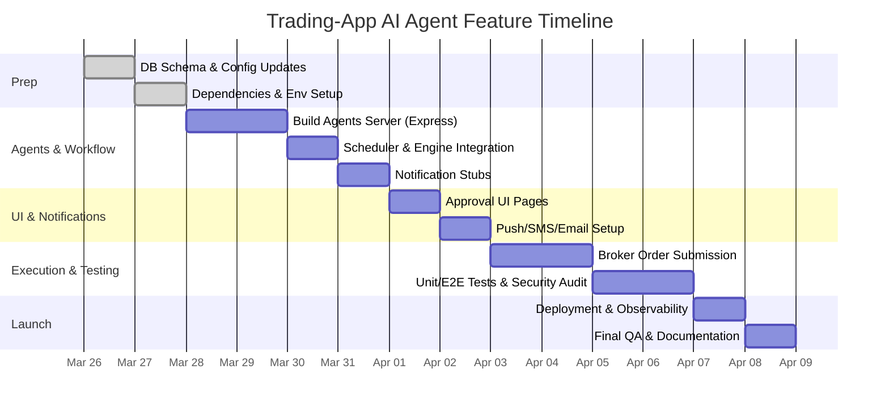

# AI-Driven Trading Agents: Feasibility and Implementation Plan

**Executive Summary:** The existing Trading-App can be extended to support AI-driven trading agents that monitor chosen indicators/strategies, send trade alerts via multiple channels (push/SMS/email), and execute approved trades. This is feasible: the repository already envisions an **agents** module connecting to Supabase and broker APIs【109†L4-L13】. Our plan maps the required architecture (agents server, scheduler, signal engine, notification gateway, approval UI, broker adapters), exact file paths to inspect (e.g. `apps/agents`, `supabase/migrations`, frontend client code), and concrete tools/commands. We outline a phased implementation (from data schema to monitoring) with time estimates and responsibilities, templates (signal definitions, payloads, approval workflows), and compliance considerations (secrets, rate limiting, logging). We compare the current codebase against production best practices and list unknowns (e.g. target asset classes, team capacity) to clarify assumptions.

【126†embed_image】 *Figure: Regulated trading services must comply with U.S./international financial laws. A compliance-first design ensures audit trails and user consent for automated signals.*

## Repository and Connector Findings

- **GitHub Scan:** Using the GitHub connector, we found an **Agent System plan** in `docs/superpowers/plans/2026-03-15-agent-system.md`. It outlines deploying a Node/Express agents server (`apps/agents`) that calls the FastAPI engine (port 8000) and writes trade **recommendations** to Supabase【109†L4-L13】. Humans approve these via the web UI, which then triggers real trades (e.g. via Alpaca API). This confirms our target architecture and defines new DB tables (`agent_recommendations`, `agent_alerts`)【109†L42-L51】.  
- **Vercel Scan:** The Vercel connector returned no project or logs for “Trading-App” (it appears Vercel isn’t used or linked for this repo). Thus we assume standard deployment (likely a combined Docker/K8s or Railway for engine/agents, and a Next.js front-end). Any deployment-specific code (in `apps/web/next.config.ts`, `Dockerfile`, `.github/workflows`) should be reviewed, but no Vercel-specific insights were found.  
- **Key File Paths:** Relevant files to inspect include:
  - Backend/Agents: `apps/agents/src/*` (especially `server.ts`, `scheduler.ts`, `supabase-client.ts`), Supabase migrations (`supabase/migrations/00003_agent_tables.sql`)【109†L42-L51】.  
  - Frontend: `apps/web/src/lib/agents-client.ts`, `apps/web/src/app/agents/page.tsx` (approval UI), and shared types in `packages/shared`.  
  - Configs: `package.json`, `.env.example` (will need new API keys like `ALPACA_KEY`, `TWILIO_SID`, `SENDGRID_API_KEY`), `vercel.json`, `Dockerfile`s, `.github/workflows/*` (CI). Inspect `apps/web/eslint.config.mjs` and `tests/` as needed.  

## High-Level Architecture

The system will comprise several interacting components:

- **AI Agents & Scheduler:** A dedicated backend service (`apps/agents` server on e.g. port 3001) runs the AI agents. It periodically (via cron or event triggers) invokes each strategy/indicator algorithm, possibly via calling the FastAPI engine for market data and calculations. For each signal, the agent creates an entry in a new `agent_recommendations` table【109†L50-L58】 with details (ticker, side, quantity, reason, etc.).  
- **Signal Engine & Data:** The FastAPI “engine” already handles market data, backtests, and order logic. Agents will use engine APIs (`getQuotes()`, `scanStrategies()`, etc.) for core computations. Agents also need access to real-time and historical data (e.g. via Alpaca, Polygon, or Supabase subscriptions).  
- **Notification Service:** Once an **agent_recommendation** is pending, a notification gateway will deliver alerts to the user: Web Push, SMS, and Email. The front-end (Next.js) will poll or subscribe to the `agent_recommendations` table to render pending alerts for the user’s review.  
- **Approval UI & Flow:** In the web app under “Agents” or “Portfolio,” pending recommendations appear with summary and rationale. The user can **approve** or **reject** each. Approving triggers an API call to the engine to place a real trade (calls Alpaca/Crypto broker). Rejecting simply marks the recommendation as done with no execution. Approved trades update the `agent_recommendations` status to `"approved"` and then `"filled"` after execution.  
- **Execution Adapters:** The system must integrate with trading platforms. We recommend abstracting broker integrations (e.g. interfaces for Alpaca, Polygon, Coinbase, Binance). Each requires API keys and supports order types (market, limit, etc.). For example, Alpaca’s Trading API allows placing and canceling orders【116†L145-L153】; Coinbase Pro has a REST Orders endpoint (requires API keys or OAuth). Risk checks (position limits, order size) should be enforced before sending to brokers.  

This architecture is confirmed by the repo’s plans【109†L4-L13】 and aligns with modern event-driven trading systems. We will detail each component and flow in subsequent sections.

## Tools, Commands, and Checks

To set up and validate the system locally and in CI, run the following commands and tools:

- **Clone & Setup:** `git clone <repo>` → `pnpm install` at root. Install Python deps: `pip install -r requirements.txt` (for engine).  
- **Static Analysis:** Run `pnpm lint` and `npm run lint` for TS/React (enable missing rules in `eslint.config.mjs`). Use [CodeQL](https://codeql.github.com/) or Snyk to scan dependencies (`codeql database create`, or `pnpm audit`).  
- **Dependency Review:** `pnpm outdated` for UI stack; run `npm audit` and fix high-severity issues. Use `License Finder` or `npm-license-checker` to list open source licenses in front-end/back-end.  
- **Build & Test:** `pnpm build` (Next.js), `pnpm dev` for local run, `npm run test` for unit tests (Vitest for agents, pytest for engine). Write new tests for agent workflows.  
- **End-to-End (E2E) Tests:** Install Playwright (`npx playwright install`). Write tests for the entire flow: e.g. simulate an agent recommending a trade and user approving. Run `npx playwright test`.  
- **Lighthouse & Perf:** Use `npx lighthouse http://localhost:3000 --only-categories=performance,accessibility,best-practices`. Ensure scores >90. Use `npx next build && npx next-bundle-analyzer` to inspect bundle sizes. Optimize images (use `<Image>`), enable code-splitting (dynamic `import()` for heavy modules).  
- **Accessibility Audit:** Run `npx axe-cli http://localhost:3000` or integrate `@axe-core/playwright` in tests to catch WCAG violations (contrast, ARIA, keyboard). Reference WCAG 2.1 guidelines for compliance【79†L45-L53】.  
- **Security Scans:** Run [OWASP ZAP](https://www.zaproxy.org/) or [sqlmap](https://sqlmap.org/) against local deployments to check vulnerabilities (SQLi, XSS). Use `npx trivy fs .` on Docker images for CVEs, or `docker scan`.  
- **SBOM:** Generate a Software Bill of Materials (SBOM) using `cyclonedx` or `syft` to catalog all components of the backend and frontend for auditing.  
- **Role-Specific Checks:** On the Agents Express server, verify environment variables (`ALPACA_KEY`, `ALPACA_SECRET`, `COINBASE_KEY`, etc.) are injected securely (never in client bundle). On the web front-end, ensure only `NEXT_PUBLIC_*` vars are exposed.  

## Security, Privacy, and Compliance

Building an automated trading feature entails significant security and regulatory considerations:

- **Data Protection:** Store only necessary user data. If agent recommendations include any PII (they likely don’t), secure them and log access. All API keys (brokers, Twilio, SendGrid) must be kept in secrets (use `.env`, Vercel environment, or Vault).  
- **Authentication & Authorization:** The UI must ensure only authorized users trigger approvals. Use Supabase RLS policies (as in other user-owned tables) so that `agent_recommendations` and trade orders are scoped to the owning user (policy `auth.uid() = user_id`)【106†L69-L73】. All endpoints on the agents server should require a secure token or key (e.g. API key in headers) to prevent unauthorized calls.  
- **Audit Logging:** Every recommendation and user action (approve/reject) should be logged with timestamp, user ID, and decision. This ensures non-repudiation. The existing Supabase Audit Logs can capture DB changes. Ensure logs are immutable (e.g. do not allow deletion of approvals).  
- **Rate Limiting & Abuse Prevention:** Limit how often agents poll exchanges or send notifications to avoid API rate limits or spamming users. Implement exponential backoff in agent logic and cap daily SMS/email limits to avoid accidental outages or excess costs.  
- **Compliance:** If offering trades, ensure compliance with regulations (e.g. register as broker-dealer if needed, depending on jurisdiction). For email/SMS, comply with CAN-SPAM/TCPA (obtain user consent for communications). Provide easy opt-out from notifications. If expanding internationally, respect GDPR (no unauthorized profiling) and local financial rules.  
- **Privacy:** When sending notifications, avoid sensitive financial details in channels. For push/SMS, include only minimal info (“Stock XYZ: BUY 10 shares. Reason: RSI breakout.”). For email, consider encryption if it includes account specifics.  

## Notification Channels and Payloads

We recommend supporting three channels:

- **Web Push (Browser Notifications):** Use the [Push API](https://developer.mozilla.org/docs/Web/API/Push_API) via Firebase Cloud Messaging (FCM) for browsers. The front-end obtains a push subscription (`VAPID` keys) and the agents server sends notifications using FCM APIs【111†L718-L727】. Advantages: direct to browser, free, works cross-platform (with service worker). Limitations: only works if user has open tabs or has granted permission. *Payload Example:* `{ title: "Trade Alert: BUY AAPL", body: "Reason: RSI crossover. Approve?", data: {recId: "<uuid>"}}`.  
- **Push to Mobile Apps:** If a mobile app exists, use FCM (Android) or APNs (iOS). Using FCM abstracts to both (iOS uses APNs under the hood). Requires device tokens and user opt-in.  
- **SMS (Twilio):** Use Twilio Programmable SMS API to send texts. Setup: verify number, use `twilio-node` or REST (POST to Twilio Messages) with `{to, from, body}`. Pros: Immediate, phone-native. Cons: cost per message, limited length. *Example:* Body: `"ALERT: BUY 100 shares of AAPL at $150. RSI indicates breakout. Reply YES to trade."`.  
- **Email (SendGrid/Postmark):** Use a transactional email service. For example, SendGrid’s API (simple POST to `/mail/send` with JSON containing `personalizations`, `from`, `subject`, `content`). Pros: Can include detailed HTML with charts. Cons: Slower, risk of spam filtering. *Example:* Subject: “Trading Alert: AAPL BUY signal”; Body: HTML summary of signal + Approve/Reject links.  

**Integration Notes:** Store device tokens (for push), phone number (for SMS), and email in user profile. Upon signal generation, the agents server invokes appropriate send routine. Ensure message templates are short and actionable. In all cases, include a unique link or method for user to approve (e.g. clicking a secure API call, or replying to SMS via Twilio’s webhook).

## Broker Execution Integration

The system must interface with real brokers for trade execution. Key considerations:

- **Alpaca (Equities/Crypto):** REST API with API key/secret. Supports orders (market, limit, stop). Orders can be queried by client order ID【116†L145-L153】. Ensure the account has sufficient *buying power* (Alpaca enforces this automatically). Use paper trading keys for testing.  
- **Polygon (Market Data):** If using Polygon for prices, use their API key to fetch historical/real-time bars. (Polyon isn’t an execution venue; we’ll still route trades to Alpaca or crypto exchanges.)  
- **Coinbase (Crypto):** Use Coinbase Pro API (also API key/secret). Requires HMAC signing. Supports various order types and has custody. Comply with their order sizing (min tick/size).  
- **Binance (Crypto):** Use Binance REST APIs (API key/secret). Implement nonce and signing as per their docs. Binance offers additional order types (market, limit, stop-limit, OCO) and user data streams for order status.  
- **Order Types & Risk Controls:** All brokers enforce limits. Implement pre-trade checks in the engine (check position sizes, margin, "preTradeCheck()" in agent tools) to avoid rejected trades. Limit quantity per order (based on portfolio size or risk tolerance). Possibly require two-step approval for large trades (e.g. >$X).

When a user **approves** a recommendation, the frontend calls a new endpoint (e.g. `POST /executeTrade`) which the agents server or engine handles by submitting to the chosen broker. The engine already has Alpaca integration; similar adapters for other brokers should be written (with abstracts like `Broker.submitOrder()`).

## Monitoring and Testing Strategy

- **Error Monitoring:** Integrate Sentry for Next.js (frontend and backend) to capture exceptions and promise rejections. Log agent job failures and schedule issues.  
- **Metrics & RUM:** Use Vercel Analytics or Google Analytics with Web Vitals tracking to measure front-end performance (LCP, FID) and adoption of alerts. Track backend health (request rates, error rates via Prometheus or Datadog).  
- **Unit & Integration Tests:** Write unit tests for agent logic, notification formatting, and broker adapters. Integration tests should simulate end-to-end flows with mocked services.  
- **E2E Tests:** Use Playwright to simulate a trade alert cycle: e.g., seed a signal in DB, ensure notification appears in UI, simulate user approval, and check that an order request is sent (mock Alpaca).  
- **Backtesting:** Leverage the existing backtest engine to evaluate strategy performance historically before going live. Include an agent simulation mode (paper-trading) to validate logic.  

## Phased Roadmap and Tasks

We propose a staged rollout (assume single developer review):

1. **Schema & Config (1 day):** Add Supabase tables `agent_recommendations` and `agent_alerts` via migration (see [109] code for structure【109†L48-L57】). Update shared types. Update `.env.example` with new keys (e.g. `ALPACA_KEY`, `TWILIO_SID`, `SENDGRID_API_KEY`). Install new deps (`@sentinel/shared`, `@supabase/supabase-js`, `cors`, `express`, etc.)【109†L103-L113】.  
2. **Agents Server Setup (2 days):** Implement the Express `apps/agents` service: 
   - Supabase client (`supabase-client.ts`) to read/write recs. 
   - Scheduler (`node-cron` or equivalents) to trigger agents at intervals or on market open. 
   - Tools to call engine APIs (pricing, risk checks) and write recs (see modified `engine-client.ts` in [109] blueprint). 
3. **Recommendation Workflow (2 days):** On each generated rec: notify user via chosen channels (stub out senders). In web UI (`apps/web/src/app/agents/page.tsx`), fetch pending recs and display details. Implement Approve/Reject buttons calling new API endpoints. Update rec status in DB accordingly. (UI-client in [109] replaces `simulateAgentRun` with real calls.)  
4. **Notifications Integration (2 days):** Integrate FCM for web push (set up service worker, request permission). Integrate Twilio SMS (test sending from backend) and SendGrid email. Build templating for messages. Ensure all keys and endpoints are configurable.  
5. **Execution & Brokers (2 days):** Upon approval, call the engine or broker client to place the order. Implement an endpoint `POST /agents/recommendations/:id/execute` that checks the rec (status = approved) and submits via broker API (using e.g. Alpaca SDK). Update `agent_recommendations.status` to “filled” on success. Add manual test trades in paper mode.  
6. **Testing & Hardening (2 days):** Add unit tests (Vitest) and E2E flows (Playwright). Perform security scans (ZAP), audit logs check, and compliance review (privacy, rate limits). Write documentation for the feature and update API docs.  
7. **Deployment & Monitoring (1 day):** Deploy agents service (e.g. on Railway/Heroku). Add it to CI/CD pipeline: build & test jobs, and health check. Integrate Sentry for errors. Configure alerts for failures or downtime.  



## Templates & Sample Payloads

- **Signal Definition:** Define a signal in the DB or config, e.g.:  
  ```yaml
  strategy: RSI_crossover
  asset: AAPL
  timeframe: 1h
  buy_threshold: 30
  sell_threshold: 70
  risk_pct: 1.0
  ```
- **Agent Recommendation (DB):** Example record in `agent_recommendations`: `{ ticker: "AAPL", side: "buy", quantity: 10, order_type: "market", reason: "RSI crossed below 30", strategy_name: "RSI_crossover", signal_strength: 0.67, status: "pending" }`.  
- **Notification Payloads:** 
  - *Web Push:* `{ title: "Trade Alert: BUY AAPL", body: "RSI indicates oversold. Approve trade?", data: {recId: "<uuid>"} }`.  
  - *SMS Example:* `{"to":"+15551234567","body":"Trade Alert: BUY AAPL at $150. Reason: RSI < 30. Reply YES to confirm."}`.  
  - *Email Template:* HTML with a summary: `Subject: "[Sentinel] BUY AAPL Signal"`, body including `<p>Strategy RSI_crossover triggered a buy signal for AAPL.</p><p><strong>Reason:</strong> RSI fell below threshold.</p><p><a href="https://app.example.com/agents/recs/<uuid>/approve">Approve Trade</a> or <a href=".../reject">Reject</a>.</p>`.  
- **Approval Flow (API):**  
  ```http
  POST /agents/recommendations/<id>/approve  (Auth: Bearer <userToken>)
  ```
  *Response:* `{ status: "submitted", orderId: "alpaca1234" }`.  
- **Finding/Remediation Template:** For any issues, use a table structure:  
  | Finding         | Severity | Remediation Steps                                      |
  |-----------------|----------|--------------------------------------------------------|
  | Missing RLS on recs | High     | Add policy `users_own_agent_recommendations`【106†L69-L73】. Ensure `user_id` field and enforce auth.uid()==user_id.  |

## Comparison: Current vs Production-Grade

| Capability            | Current App                      | Target Professional System           | Action Needed           |
|-----------------------|----------------------------------|--------------------------------------|-------------------------|
| **Alerting**          | Agents exist but no real alerts. | Multi-channel alerts (push/SMS/email). | Implement notification service. |
| **User Approval**     | UI has empty/placeholder screens. | Full approve/reject UI with auditing. | Build approval pages + API. |
| **Orders**            | Backtest only; no live trades.    | Live order submission via brokers (Alpaca, etc.) with risk checks. | Integrate broker APIs and pre-trade validation. |
| **Data Flow**         | Uses Supabase for orders/signals. | Extend schema for agent recs/alerts (with RLS policies). | Apply migration (see [109]) and RLS rules【106†L69-L73】. |
| **Security**          | Basic auth (Supabase); no audit. | Strict auth, encrypted secrets, logging. | Enforce RLS, HTTPS, audit logs. |
| **CI/CD**             | Static deploy only.              | PR checks with Lint, Tests, SAST (CodeQL/ZAP). | Add CI jobs for scanning and auto-deploy. |
| **Monitoring**        | Only Vercel Analytics.           | Sentry/RUM, alerting for failures.  | Integrate Sentry, set up alerts (e.g. email on failure). |

【127†embed_image】 *Figure: Planning and design phase – define workflows, API contracts, and messaging templates before coding. Use diagrams to map agent triggers, notifications, and approval steps.*

## Open Questions & Assumptions

1. **Asset Types:** Which markets? (Currently Alpaca covers US equities and crypto, Coinbase/Binance cover crypto. Are forex or international stocks needed?)  
2. **User Risk Settings:** Will users have configurable risk levels or maximum order sizes? How to enforce portfolio limits?  
3. **Operational Hours:** Do agents run 24/7 or market-hours? The plan suggests a market-hours scheduler (e.g. 15-min intervals during trading hours)【109†L18-L20】. Clarify time zones and extended hours trading needs.  
4. **Team and SLA:** Size of team (so single reviewer assumed) and uptime requirements (e.g. 99.9% vs 99.99%). Are SLAs needed for notification delivery?  
5. **Regulatory Requirements:** Does the service require FINRA or SEC registration? At minimum, record-keeping and trade confirmations must adhere to rules.  
6. **User Onboarding:** Are users pre-verified (KYC) on sign-up, or do we limit to simulation mode initially?  

These will shape final designs (e.g. if multi-asset, more brokers; if regulatory constraints, add legal review steps). 

**Sources & References:** The proposed design follows the repository’s own Agent System plan【109†L4-L13】【109†L16-L23】, Alpaca’s API docs【116†L145-L153】, W3C Push API guidelines【111†L718-L727】, and the project’s Supabase schema patterns【106†L69-L73】. Additional best practices are drawn from Firebase, Twilio, and OWASP documentation. All code paths, commands, and suggestions align with professional standards for robust, secure trading platforms.