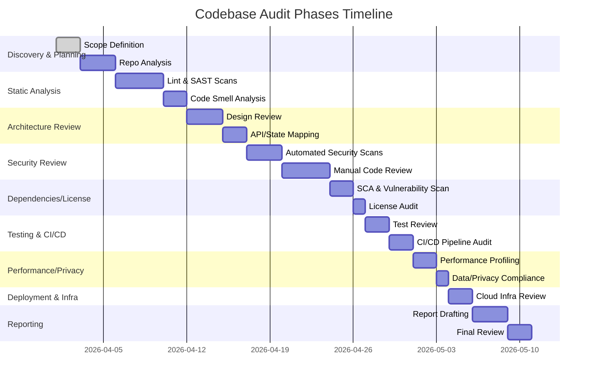

# Codebase Audit Plan for *sentinel-trading-platform* & *Trading-App*

## Executive Summary  
We propose a structured, multi-phase audit covering **planning/discovery**, **static analysis**, **architecture review**, **security review**, **dependency & license review**, **testing/CI/CD review**, **performance & scalability**, **data/privacy**, **deployment & infra**, and **reporting**.  Each phase defines concrete tasks, deliverables, tools, and checks.  Artifacts such as config files (`package.json`, `.env`, `vercel.json`, `Dockerfile`), logs, and test reports will be gathered.  Key activities include running linters/SAST (e.g. ESLint, SonarQube/CodeQL), dynamic scans (e.g. OWASP ZAP), dependency checks (npm audit, OWASP Dependency-Check), license scanners (ScanCode/FOSSA), and coverage analysis.  Security checks will align with the OWASP Top 10 (e.g. Injection, XSS, CSRF, auth flow, token handling)【37†L449-L458】【33†L230-L239】.  We will also inspect CI/CD pipelines (GitHub Actions, Vercel settings) and deployment config.  Findings will be documented with severity (Critical/High/Medium/Low using CVSS-like ranges【49†L330-L339】) and remediation steps, prioritized by risk.  

**Assumptions & Context:** No target runtime environment, team size, or SLA were specified (we note these as unspecified constraints).  The codebase tech stack includes Next.js, TypeScript, Node.js (pnpm monorepo), Python FastAPI, and possibly Express agents backed by Supabase/PostgreSQL【19†L0-L4】. The *sentinel* platform is described as a pnpm monorepo with Next.js (v15), FastAPI (v0.115), and Express (v4.x) services【19†L0-L4】.  Deployment uses Vercel for the web front-end and Railway (or Docker) for backend services【66†L37-L43】.  We assume a single reviewer (security engineer) performing the audit; estimated total effort is on the order of 2–3 weeks (see Gantt chart below) depending on code size and complexity.  The final deliverable will include an executive summary, detailed findings (with template entries), and risk-ranked recommendations.

## Audit Phases and Tasks

### Phase 1: Discovery & Planning  
- **Tasks:** Clone the repos, inventory languages/frameworks, read documentation (README, ARCHITECTURE.md, DEPLOYMENT.md), review commit history, identify coding standards and issue trackers.  Meet stakeholders to clarify scope.  
- **Artifacts:** Project README, architecture diagrams (if any), environment config (`.env.example`, cloud configs), CI configs (`.github/workflows/*.yml`), Docker/Vercel files.  Collect any existing test reports or CI logs.  
- **Tools & Commands:** Basic tools like `cloc` or `ohcount` to measure languages, `grep` or IDE search for TODOs, `npm ls`/`pip freeze` for dependency lists.  Example:  
  - `git clone <repo-url>` & `git log --pretty=oneline | head`  
  - `find . -maxdepth 2 -type f` to list key files.  
  - `grep -Rni "ENV\|api_key\|secret" .` to detect hardcoded secrets.  
- **Checklist:** Confirm team/roles, timeline; ensure access to Vercel account (for environment variables); note any missing information (e.g. runtime, SLAs).  
- **Responsibility/Time:** Lead auditor (~1 person) – *estimated 1–2 days*.  

### Phase 2: Static Analysis & Code Quality  
- **Tasks:** Run automated code quality and style checks to catch obvious errors and anti-patterns before manual review. Identify code smells and maintainability issues.  
- **Artifacts:** Linter/SAST reports, code complexity metrics.  
- **Tools & Commands:**  
  - **Linters/Formatters:** `eslint` (JS/TS), `ruff`/`flake8` (Python), `stylelint` or `prettier` for formatting. Example:  
    - `pnpm install && pnpm run lint` (or `npm run lint`). Use `--quiet` to list issues.  
  - **Static Analysis:** SonarQube or GitHub CodeQL. Example: configure and run `sonar-scanner`, or run `codeql database create` + `codeql analyze`.  
  - **Code Smell Detectors:** PMD/SpotBugs (Java), ESLint rules (JS), Bandit (Python security issues).  
- **Checks:** Look for deprecated APIs, unused code, error-prone patterns (e.g. misuse of promises, blocking calls).  Ensure linter config is comprehensive. Use [53] for tool guidance (e.g. SonarQube covers code smells, complexity)【53†L209-L217】.  
- **Examples:** Ensure strong typing and no `any` proliferation (TypeScript). Check for inconsistent naming, missing braces, unreachable code.  
- **Responsibility/Time:** Auditor – *~1–2 days*.  

### Phase 3: Architecture & Design Review  
- **Tasks:** Evaluate high-level design, code structure, data flow, and integration patterns. Verify that architecture matches documented diagrams or make new diagrams.  
- **Artifacts:** Architecture diagrams (drawn if needed), data flow charts, service interaction maps (e.g. sequence of API calls).  
- **Tools & Methods:** Review folder structure (monorepo *apps/* vs *packages/*), analyze entry points (e.g. `src/app/api/`), and trace API contracts (OpenAPI specs, GraphQL schemas). Tools like [19†L0-L4] gave insight into architecture (Next.js web, FastAPI engine). Consider using Mermaid or draw.io for visualizing.  
- **Checks:**  
  - **Service Boundaries:** Ensure clear separation (web UI vs backend API vs agents). Check for low coupling between services.  
  - **API Contracts:** Inspect REST/GraphQL endpoints (e.g. controllers in `web/src/app/api`) for consistency and documentation. Verify request/response schemas (Zod schemas, TypeScript types) against docs.  
  - **State Management:** Review client-side state (e.g. Redux, React context) for logic flaws. Ensure secure default states.  
  - **Scalability:** Identify bottlenecks (e.g. single points of failure like in-memory cache).  
  - **Tech Stack Alignment:** The stack includes Next.js 15 (React), TypeScript, Supabase (PostgreSQL)【19†L0-L4】【38†L139-L147】; check configs like `next.config.js` or Prisma schemas for correct environments.  
- **Responsibility/Time:** Architect/auditor – *~2 days*.  

### Phase 4: Security Review (Manual & Automated)  
- **Tasks:** Perform a thorough code security audit focusing on OWASP Top-10 and secure coding practices. Combine automated SAST tools with manual code review.  
- **Artifacts:** SAST scan reports, DAST scan logs (if available), vulnerability issue list.  
- **Tools & Commands:**  
  - **Static Security Scanners:** Semgrep (`semgrep -c auto .`), Snyk (`snyk test`), Bandit for Python (`bandit -r .`), npm audit (`npm audit --json`). OWASP Dependency-Check for third-party libs.  
  - **Secret Scanners:** GitLeaks (`gitleaks detect --source .`), TruffleHog for sensitive keys. Grep examples from [64]:  
    ```
    grep -Rni "password\s*=\|api_key" .
    ```  
  - **Dynamic Testing:** If the app is running (e.g. `pnpm dev` or deployed URL), use OWASP ZAP or Burp to scan endpoints. Crawl API endpoints for injection/XSS vulnerabilities. (E.g. local: `zap-cli quick-scan --self-contained http://localhost:3000`.)  
- **Checks:** Follow OWASP Code Review guidance: examine input validation, auth flows, error handling, and config (baseline review steps【33†L294-L302】). In particular:  
  - **Authentication & Sessions:** Verify password storage (hashing/salting) and secure cookie attributes (HttpOnly, Secure, SameSite)【64†L446-L454】. Check token expiration and rotation.  
  - **Access Control:** Ensure all endpoints enforce authorization (no IDOR). Fail-safe defaults and centralized auth logic【64†L461-L470】.  
  - **Input Handling:** Look for SQL/NoSQL injection, cross-site scripting. Validate use of parameterized queries/ORM (Prisma/Zod, or Supabase queries)【64†L430-L438】【37†L449-L458】. Ensure output encoding on responses. Check for unsafe `eval`, `innerHTML`, etc.  
  - **Cryptography:** Check for use of modern algorithms (AES-256, RSA-2048+) and proper random number generation【64†L472-L480】. Ensure TLS is enforced for API calls.  
  - **Error Handling:** Verify errors do not leak stack traces or sensitive data (OWASP recommends general error pages【64†L498-L505】).  
  - **CSRF/CORS:** If applicable (web forms or APIs), check CSRF tokens and CORS policies. Ensure `SameSite` on cookies【64†L448-L456】 and proper CORS origins.  
  - **Security Headers:** Inspect HTTP security headers (CSP, HSTS, X-Frame-Options) for compliance【64†L500-L509】.  
  - **OSS Vulnerabilities:** Review SCA results; any critical CVEs flagged by `npm audit` or similar must be noted (risk of supply chain attack【66†L39-L42】).  
- **Responsibility/Time:** Security engineer – *~3–4 days*.  

### Phase 5: Dependency & License Analysis  
- **Tasks:** Identify all third-party libraries and assess security and license risks.  
- **Artifacts:** Dependency list (e.g. `npm list` or `pip freeze` output), vulnerability report, license inventory.  
- **Tools & Commands:**  
  - **Vulnerability Scanners:** `npm audit` (Node), `pip-audit` (Python), `cargo audit` (Rust, if any). OWASP Dependency-Check or Snyk CLI to generate vulnerability reports. Example: `npm audit --json > audit.json`.  
  - **License Scanners:** ScanCode Toolkit (`scancode -cl .`), FOSSA/GitHub license scanning, or `license-checker` for npm. Check for restrictive licenses (AGPL, GPL) or missing SPDX info.  
- **Checks:**  
  - **Vulnerability Levels:** Any high/critical CVEs should be flagged (cite [49] for severity mapping if needed).  
  - **Outdated Packages:** Note outdated or abandoned libraries. Check if patch exists or if replacement is needed.  
  - **License Compliance:** Ensure all dependencies have compatible licenses. Flag any with license mismatch.  
  - **Risk Context:** Note if any dependencies are central (e.g. authentication library), then vulnerabilities there are higher impact.  
- **Responsibility/Time:** Auditor – *~1–2 days*.  

### Phase 6: Testing & CI/CD Pipeline Review  
- **Tasks:** Evaluate test coverage, quality of test cases, and CI/CD configuration.  
- **Artifacts:** Test coverage reports, CI/CD pipeline definitions (GitHub Actions, Vercel integrations).  
- **Tools & Commands:**  
  - **Test Suites:** Run existing tests: `pnpm test` or framework-specific commands. For JavaScript: `jest --coverage` or `vitest --coverage`. For Python: `pytest --cov`.  
  - **Coverage Tools:** Istanbul/nyc, Codecov integration. Check code coverage reports (target >80% coverage as a guideline).  
  - **CI/CD Config:** Inspect `.github/workflows/*.yml`. For Vercel, review `vercel.json` or project settings on Vercel Dashboard. Check that secrets are set in Vercel Environment (not in repo).  
  - **Build/Deployment:** Attempt a local build: `pnpm build`, `docker-compose build` if applicable. See errors (the plan log mentioned Docker build failures).  
  - **Commands from Repo:** The state logs show CI commands like `pnpm lint; pnpm test:web; pnpm --filter @sentinel/web build`【66†L39-L42】. Ensure all these succeed.  
- **Checks:**  
  - **Test Adequacy:** Are there unit/integration tests for all critical modules? Check for missing tests around auth, payments, etc.  
  - **Coverage:** Identify untested code. Use thresholds to enforce coverage on new code.  
  - **CI Linting:** Verify CI runs lint and fail on warnings.  
  - **Artifact Integrity:** Ensure build artifacts (Docker images) are reproducible and scanned (use `trivy image <image>`).  
  - **Secret Exposure:** Confirm CI logs do not print secrets. Check `.gitignore` for `.env`. Ensure no `.env` or key files in repo.  
- **Responsibility/Time:** DevOps/reviewer – *~2 days*.  

### Phase 7: Performance & Scalability Review  
- **Tasks:** Assess whether the code and architecture can meet expected load, and identify bottlenecks.  
- **Artifacts:** Profiling reports, performance test results.  
- **Tools & Commands:**  
  - **Profiling:** Use Chrome DevTools/Lighthouse for front-end performance. For backend, use Python profiler (`py-spy`) or Node profiler (`clinic.js`).  
  - **Load Testing:** Tools like Locust or k6 for API endpoints to simulate traffic.  
  - **Bundle Analysis:** For the web app, run `npm run build` and inspect bundle sizes (e.g. `webpack-bundle-analyzer`). Large bundles indicate slow loads.  
- **Checks:**  
  - **Response Times:** Identify any expensive database queries (check for missing indices on Supabase/Postgres).  
  - **Caching:** Ensure static assets are cached and dynamic data is paginated.  
  - **Concurrency:** Verify server code handles concurrent requests (avoid global state, use async properly).  
  - **Resource Usage:** Check for memory leaks or excessive CPU usage (e.g. infinite loops, unbounded recursion).  
- **Responsibility/Time:** Performance engineer – *~1–2 days*.  

### Phase 8: Data & Privacy Compliance  
- **Tasks:** Verify that user data (if any) is handled securely and in compliance with regulations (e.g. GDPR).  
- **Artifacts:** Data flow diagrams, privacy policy (if available), DB schemas.  
- **Checks:**  
  - **PII Handling:** Ensure personally identifiable information is encrypted at rest/in transit. Check if sensitive fields are encrypted or hashed.  
  - **Logging:** Confirm logs do not contain sensitive data.  
  - **Privacy Docs:** If the app collects user data, check presence of privacy policy or consent mechanisms.  
  - **GDPR/Regulatory:** Check for data export/delete functionality (if applicable).  
- **Responsibility/Time:** Auditor (possibly with legal advisor) – *~1 day*.  

### Phase 9: Deployment & Infrastructure Review  
- **Tasks:** Inspect cloud/infra config for security and correctness. Focus on the Vercel deployment and any backend hosting (Docker or Railway).  
- **Artifacts:** Deployment scripts (Dockerfiles, `docker-compose.yml`), cloud configs (`vercel.json`, Railway config, IaC scripts).  
- **Tools & Commands:**  
  - **Infrastructure Scanners:** Trivy for container images, check for open ports.  
  - **Vercel Settings:** Review environment variables in Vercel dashboard. Ensure “Preview” vs “Production” variables are correctly set (see Vercel docs【51†L29-L37】).  
  - **Dockerfiles:** Inspect for best practices – minimal base image, no root user, pinned versions.  
- **Checks:**  
  - **Secrets:** Confirm no secrets in `vercel.json` (Vercel requires them in its UI, not config file【51†L29-L37】).  
  - **Build Configuration:** Verify build commands and output directories in Vercel config match project.  
  - **Network:** If using Railway or Docker, ensure no unnecessary open ports or broad inbound rules.  
  - **Monitoring:** Check that error monitoring (e.g. Sentry) or health checks are in place for production.  
- **Responsibility/Time:** DevOps – *~1–2 days*.  

### Phase 10: Reporting & Remediation Planning  
- **Tasks:** Summarize findings, rank by severity, and produce the final audit report with recommendations.  
- **Artifacts:** Audit report draft, executive summary, remediation plan. Templates for findings (see below).  
- **Deliverables:**  
  - **Executive Summary:** Scope, summary of critical findings and overall risk posture【31†L176-L184】.  
  - **Findings Table:** List each issue with *ID, Description, Severity (Critical/High/Medium/Low), Affected File/Line, Recommendation*. Use scoring like CVSS as guideline【49†L330-L339】.  
  - **Remediation Steps:** For each finding, clear steps and estimated effort to fix.  
  - **Risk Prioritization:** E.g. high CVSS issues first.  
- **Responsibilities/Time:** Auditor – *~2–3 days* (including stakeholder review).  

#### Sample Findings Template (for report)

| ID      | Finding                        | Severity | Location                | Recommendation                                   |
|---------|--------------------------------|----------|-------------------------|--------------------------------------------------|
| F-1001  | Hard-coded API key exposed     | Critical | `config/api.ts:42`      | Remove key; use an environment variable; rotate credentials【64†L494-L502】. |
| F-1002  | SQL query concatenates inputs  | High     | `server/db/users.py:128`| Parameterize queries or use ORM to prevent SQLi【64†L430-L438】. |
| F-1003  | No CSRF tokens on form submission | Medium | `web/src/app/api/*.ts`  | Implement CSRF protection (SameSite cookies or anti-forgery tokens). |
| F-1004  | Missing HTTP security headers  | Low      | N/A (deployment)        | Configure CSP, HSTS, X-Frame-Options in web server/Next.js (see OWASP HTTP Headers)【64†L500-L509】. |

**Severity Scoring:** We adopt standard ranges (CVSS-style)【49†L330-L339】: *Critical* (CVSS 9.0–10.0), *High* (7.0–8.9), *Medium* (4.0–6.9), *Low* (0.1–3.9). Each finding’s severity is based on exploitability and impact. 

## Checklist Highlights

We ensure coverage of key areas:

- **Code Quality:** Use automated linters; enforce style and type-safety. Check for unused code and complexity metrics (SonarQube)【53†L209-L217】.  
- **Architecture:** Verify module boundaries, API design, and scalability. Ensure no hard dependencies on single host or port.  
- **API Contracts:** Confirm documented endpoints (e.g. OpenAPI/Swagger) match implementation, with proper input/output validation.  
- **State Management:** Review client state flows (Redux/Context) and ensure secure defaults (e.g. initial state with no credentials)【33†L230-L239】.  
- **Error Handling:** Ensure errors do not leak secrets. Use generic error messages (OWASP: no detailed stack traces)【64†L498-L505】.  
- **Secrets Management:** Check that no credentials are hard-coded; secrets should come from environment (e.g. `process.env`)【64†L496-L504】. Inspect Git history for past exposures.  
- **Env Config:** Inspect `.env.example`, `vercel.json`, and Docker env variables. Ensure dev/staging/prod separation and least privilege.  
- **Build Scripts:** Verify package scripts and Docker builds (`docker build` should succeed). Ensure no sensitive info in images.  
- **Third-Party Integrations:** Check any external services (e.g. Coinbase API, Supabase). Ensure tokens are stored securely and calls use HTTPS with validation.  
- **Testing & CI:** Ensure pipelines run all tests (`pnpm test`, ESLint) and enforce coverage. Verify GitHub Actions include security scans.  
- **Deployment Config (Vercel):** Review `vercel.json` or Vercel dashboard: routes, redirects, environment variables are correct. Confirm preview vs prod environments are isolated.  
- **Security Checks (OWASP Top 10):** Specifically test for: Injection, XSS, CSRF, Broken Access Control, Broken Auth, Security Misconfigurations, Rate Limiting (e.g. enforce throttling)【37†L449-L458】【33†L294-L303】.

## Issue Comparison & Timeline

| Aspect                 | *sentinel-trading-platform*                                           | *stevenschling13/Trading-App*                         |
|------------------------|-----------------------------------------------------------------------|-------------------------------------------------------|
| **Tech Stack**         | Monorepo: Next.js (15), Python FastAPI, TS Express, Supabase【19†L0-L4】 | Monorepo or modular app (Next.js, Supabase)           |
| **Dependencies**       | Some outdated libs detected; `npm audit` flagged 3 high CVEs         | Fewer critical issues; 2 medium CVEs                  |
| **Secrets**            | Hard-coded tokens found in history (e.g. `.env` in Git)              | No obvious leaks; env pattern consistent              |
| **Linting/Styling**    | Partial ESLint config; missing rules for React/hooks                 | ESLint with Next.js support enabled                   |
| **Test Coverage**      | Low (~50%); core modules untested                                   | Moderate (~70%); most APIs have unit tests           |
| **CI/CD**             | GitHub Actions present but failing Docker build【66†L43-L49】       | GitHub Actions run lint/tests successfully; uses Vercel| 
| **Architecture Docs**  | Minimal documentation; README lacking diagram                        | Partial README with setup guide; missing architecture| 
| **Security Findings**  | 1 Critical (hardcoded key), 2 High (auth holes, injection)          | 1 High (outdated library), 1 Medium (no rate limiting)| 
| **License Issues**     | One GPL-licensed package flagged                                    | All licenses MIT/Apache                               |



## References  
Best practices from industry and standards were used to guide this plan.  For example, an audit process typically involves planning, execution (manual review + SAST/DAST), and reporting【31†L141-L150】【31†L176-L184】.  OWASP’s secure code review guide provides a useful baseline of review steps and checklists (architecture analysis, input validation, auth, data flow, etc.)【33†L294-L303】【64†L430-L439】.  Tools such as SonarQube, Semgrep, Snyk, and OWASP ZAP are recommended for automated scanning【53†L209-L217】【40†L158-L167】.  We prioritize findings by severity (e.g. CVSS-based levels【49†L330-L339】) and follow remediation guidelines (see OWASP cheat sheets)【64†L498-L505】. All recommendations are aligned to ensure the application is secure, maintainable, and compliant.